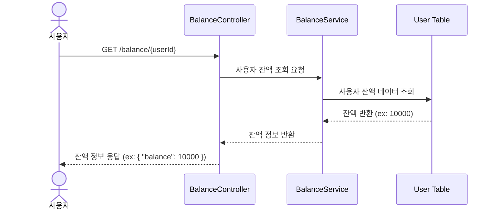
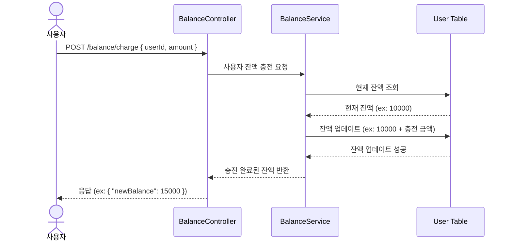
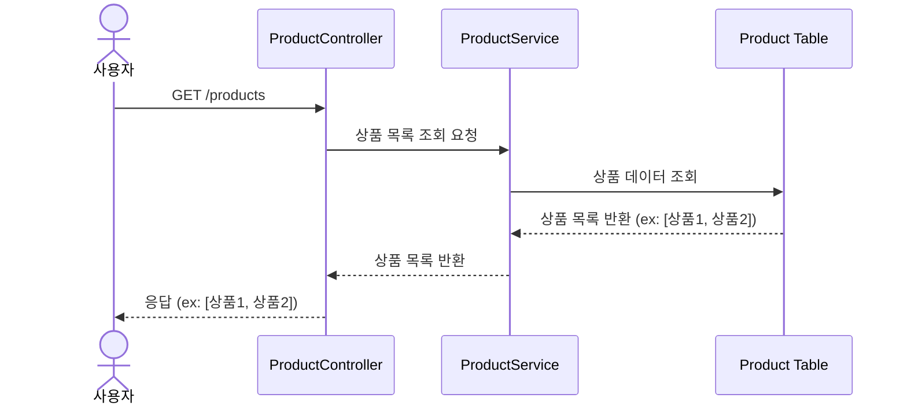
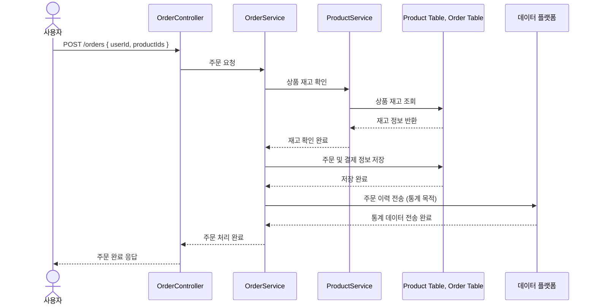
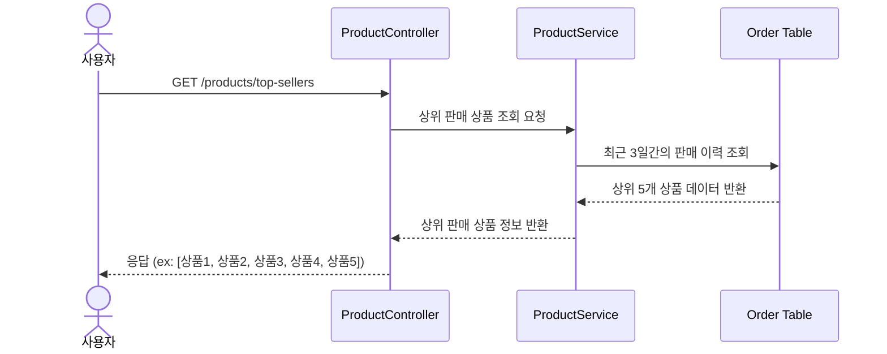

# E-commerce

## 요구사항
1️⃣ **`주요`** **잔액 충전 / 조회 API**

- 결제에 사용될 금액을 충전하는 API 를 작성합니다.
- 사용자 식별자 및 충전할 금액을 받아 잔액을 충전합니다.
- 사용자 식별자를 통해 해당 사용자의 잔액을 조회합니다.

2️⃣ **`기본` 상품 조회 API**

- 상품 정보 ( ID, 이름, 가격, 잔여수량 ) 을 조회하는 API 를 작성합니다.
- 조회시점의 상품별 잔여수량이 정확하면 좋습니다.

3️⃣ **`주요`** **주문 / 결제 API**

- 사용자 식별자와 (상품 ID, 수량) 목록을 입력받아 주문하고 결제를 수행하는 API 를 작성합니다.
- 결제는 기 충전된 잔액을 기반으로 수행하며 성공할 시 잔액을 차감해야 합니다.
- 데이터 분석을 위해 결제 성공 시에 실시간으로 주문 정보를 데이터 플랫폼에 전송해야 합니다. ( 데이터 플랫폼이 어플리케이션 `외부` 라는 가정만 지켜 작업해 주시면 됩니다 )

> 데이터 플랫폼으로의 전송 기능은 Mock API, Fake Module 등 다양한 방법으로 접근해 봅니다.

4️⃣ **`기본` 상위 상품 조회 API**

- 최근 3일간 가장 많이 팔린 상위 5개 상품 정보를 제공하는 API 를 작성합니다.
- 통계 정보를 다루기 위한 기술적 고민을 충분히 해보도록 합니다.

## 프로젝트 Milestone
### Week 1: 기본 구조 및 API 설계 (10/06 - 10/10)
- [x] 프로젝트 기본 구조 설정 (Layered + Clean Architecture)
- [x] 주요 API 설계 및 Mock 데이터 반환
    - [x] 사용자 잔액 조회 API
    - [x] 사용자 잔액 충전 API
    - [x] 상품 목록 조회 API
    - [x] 상품 주문 API
    - [x] 상위 판매 상품 조회 API
- [x] DB 스키마 설계 및 ERD 작성

### Week 2: 비즈니스 로직 구현 (10/13 - 10/17)
- [ ] 사용자 잔액 관련 로직 구현 (충전, 차감, 조회)
- [ ] 상품 목록 조회 로직 및 재고 관리 구현
- [ ] 결제 로직 및 주문 처리 흐름 구현
- [ ] 통계 데이터 처리 (상위 판매 상품 조회)

### Week 3: 고도화 (10/20 - 10/24)
- [ ] Redis 등을 통한 캐시 적용
- [ ] 주문 처리 로직 개선 (비동기 처리, 상태 관리 등)
- [ ] 장바구니 로직 구현 (Optional)

## API 명세

## 요청별 시퀀스 다이어그램

### 사용자 잔액조회

 

### 잔액 충전

 

### 상품 목록 조회

 

### 상품 주문

 

### 판매량 상위 상품 조회

## ERD

## 패키지 구조 및 기술 스택
### 패키지 구조
현재 패키지 구조와 동일함.  

### 기술 스택
DB: H2 Database  
ORM: Spring Data JPA  
API: Spring Web  
테스트: JUnit5, Mockito
